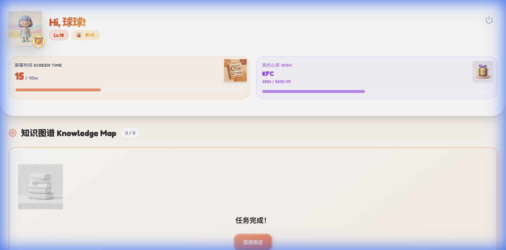
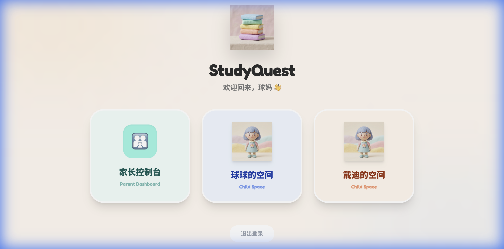
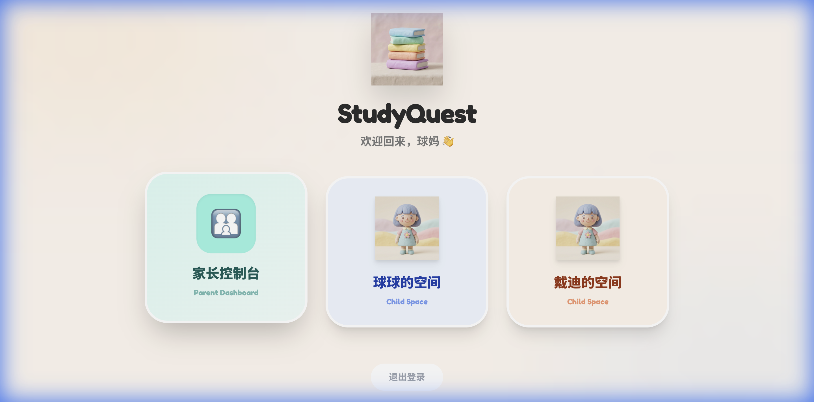

<p align="center">
  
</p>

<h1 align="center">📚 StudyQuest</h1>

<p align="center">
  <strong>The Ultimate Learning Companion for Kids (6-16 years old)</strong><br/>
  <strong>孩子的智能学习神器（6-16岁）</strong>
</p>

<p align="center">
  <a href="#english">English</a> •
  <a href="#中文">中文</a>
</p>

<p align="center">
  
  
  
  
  
</p>

---

<a name="english"></a>

## 🌟 English

### What is StudyQuest?

StudyQuest is an **AI-powered family learning system** that transforms daily study into an engaging adventure. Designed for children aged 6-16, it combines:

- 🎮 **Gamification**: XP points, streaks, and rewards to keep kids motivated
- 🤖 **AI Tutor**: Powered by Google Gemini for personalized learning
- 👨‍👩‍👧 **Family Mode**: Parents can monitor progress and set learning goals
- 📱 **PWA**: Works on any device, installable like a native app

### ✨ Features

| Feature | Description |
|---------|-------------|
| 📸 **Smart Content Import** | Take photos of textbooks, worksheets, or exams - AI extracts and analyzes content |
| 📝 **Adaptive Quizzes** | AI generates questions based on the child's mastery level |
| 🧠 **Knowledge Graph** | Tracks mastery of individual knowledge points |
| 🎁 **Reward System** | Earn XP to redeem screen time, outdoor activities, or custom rewards |
| 👀 **Parent Dashboard** | Monitor learning progress, set goals, and manage rewards |
| 📖 **Reading Mode** | Interactive reading with comprehension checks |

### 📸 Screenshots

<table>
  <tr>
    <td></td>
    <td></td>
  </tr>
  <tr>
    <td align="center"><em>Child Dashboard</em></td>
    <td align="center"><em>Quest Mode</em></td>
  </tr>
  <tr>
    <td></td>
    <td></td>
  </tr>
  <tr>
    <td align="center"><em>Parent Dashboard</em></td>
    <td align="center"><em>Knowledge Graph</em></td>
  </tr>
</table>

### 🚀 Quick Start

#### Prerequisites

- Node.js 18+
- npm or pnpm
- [Supabase](https://supabase.com) account (free tier works)
- [Google AI Studio](https://aistudio.google.com) API key (Gemini)

#### Installation

```bash
# 1. Clone the repository
git clone https://github.com/mixybkig666/studyquest.git
cd studyquest

# 2. Install dependencies
npm install

# 3. Set up environment variables
cp .env.example .env.local
# Edit .env.local with your API keys

# 4. Start development server
npm run dev
```

#### Environment Variables

Create a `.env.local` file:

```env
GEMINI_API_KEY=your_gemini_api_key_here
VITE_SUPABASE_URL=your_supabase_project_url
VITE_SUPABASE_ANON_KEY=your_supabase_anon_key
```

#### Database Setup

1. Create a new Supabase project
2. Go to SQL Editor
3. Run the contents of `database/supabase_setup.sql`
4. (Optional) Run additional schema files for advanced features

### 📁 Project Structure

```
studyquest/
├── components/       # React components
├── views/           # Page views
├── services/        # Business logic & API calls
├── contexts/        # React contexts
├── hooks/           # Custom hooks
├── assets/          # Images and icons
├── database/        # SQL schema files
│   ├── supabase_setup.sql    # Main setup script
│   ├── knowledge_mastery.sql # Knowledge graph tables
│   └── master_agent_tables.sql # AI agent tables
└── docs/            # Documentation
```

### 🛠 Tech Stack

- **Frontend**: React 19 + TypeScript + Vite
- **Styling**: TailwindCSS
- **Database**: Supabase (PostgreSQL)
- **AI**: Google Gemini API
- **Hosting**: Cloudflare Pages

### 📄 License

MIT License - feel free to use this for your own family or educational projects!

---

<a name="中文"></a>

## 🌟 中文

### StudyQuest 是什么？

StudyQuest 是一个 **AI 驱动的家庭学习系统**，将日常学习变成有趣的冒险。专为 6-16 岁儿童设计，它结合了：

- 🎮 **游戏化学习**：XP 积分、连续天数、奖励系统保持孩子学习动力
- 🤖 **AI 智能辅导**：基于 Google Gemini 提供个性化学习
- 👨‍👩‍👧 **家庭模式**：家长可以监控进度、设置学习目标
- 📱 **PWA 应用**：支持任何设备，可像原生应用一样安装

### ✨ 核心功能

| 功能 | 描述 |
|------|------|
| 📸 **智能导入** | 拍照上传课本、作业、试卷 - AI 自动提取并分析内容 |
| 📝 **自适应练习** | AI 根据孩子的掌握程度生成个性化题目 |
| 🧠 **知识图谱** | 追踪每个知识点的掌握情况 |
| 🎁 **奖励系统** | 赚取 XP 兑换屏幕时间、户外活动或自定义奖励 |
| 👀 **家长看板** | 监控学习进度、设置目标、管理奖励 |
| 📖 **阅读模式** | 交互式阅读，带理解检测 |

### 📸 界面截图

<table>
  <tr>
    <td></td>
    <td></td>
  </tr>
  <tr>
    <td align="center"><em>孩子仪表盘</em></td>
    <td align="center"><em>答题模式</em></td>
  </tr>
  <tr>
    <td></td>
    <td></td>
  </tr>
  <tr>
    <td align="center"><em>家长看板</em></td>
    <td align="center"><em>知识图谱</em></td>
  </tr>
</table>

### 🚀 快速开始

#### 前置要求

- Node.js 18+
- npm 或 pnpm
- [Supabase](https://supabase.com) 账号（免费套餐即可）
- [Google AI Studio](https://aistudio.google.com) API 密钥（Gemini）

#### 安装步骤

```bash
# 1. 克隆仓库
git clone https://github.com/mixybkig666/studyquest.git
cd studyquest

# 2. 安装依赖
npm install

# 3. 配置环境变量
cp .env.example .env.local
# 编辑 .env.local 填入你的 API 密钥

# 4. 启动开发服务器
npm run dev
```

#### 环境变量

创建 `.env.local` 文件：

```env
GEMINI_API_KEY=你的_gemini_api_key
VITE_SUPABASE_URL=你的_supabase_项目_url
VITE_SUPABASE_ANON_KEY=你的_supabase_anon_key
```

#### 数据库设置

1. 创建一个新的 Supabase 项目
2. 进入 SQL Editor
3. 运行 `database/supabase_setup.sql` 的内容
4. （可选）运行其他 schema 文件以启用高级功能

### 📁 项目结构

```
studyquest/
├── components/       # React 组件
├── views/           # 页面视图
├── services/        # 业务逻辑 & API 调用
├── contexts/        # React 上下文
├── hooks/           # 自定义 Hooks
├── assets/          # 图片和图标
├── database/        # SQL 数据库文件
│   ├── supabase_setup.sql    # 主要设置脚本
│   ├── knowledge_mastery.sql # 知识图谱表
│   └── master_agent_tables.sql # AI Agent 表
└── docs/            # 文档
```

### 🛠 技术栈

- **前端**: React 19 + TypeScript + Vite
- **样式**: TailwindCSS
- **数据库**: Supabase (PostgreSQL)
- **AI**: Google Gemini API
- **部署**: Cloudflare Pages

### 🤝 贡献

欢迎提交 Issue 和 Pull Request！

### 📄 开源协议

MIT License - 可自由用于个人或教育项目！

---

<p align="center">Made with ❤️ for families who care about learning</p>
